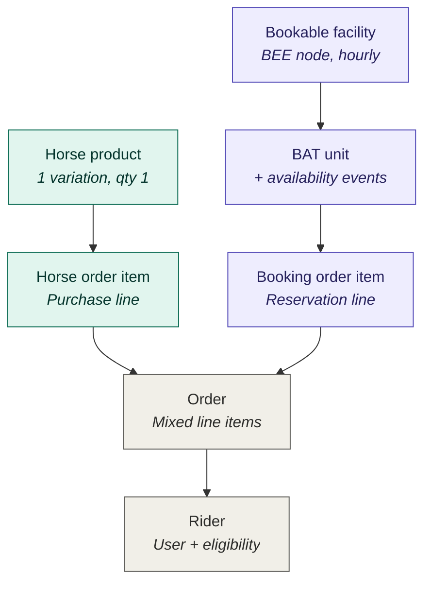

# shh — Entity / Content-Type Model

Part of [[shh-stables-platform]]. Drupal 11 site combining horse sales, hourly
riding-area reservations, and an hourly riding-hall reservation. Stack: **Drupal
Commerce** (sales) + **BAT** (booking framework) + **BEE** (Bookable Entities
Everywhere — bridges BAT into Commerce). See [[0013-bat-bee-booking-framework]] for
the decision record.

## Upfront modeling decisions

**1. Model horses as Commerce products, not nodes.**
Commerce products are fully fieldable and have canonical pages, so a *Horse* product *is*
the catalog/detail page. A parallel node + product-reference only buys a sync problem.
Each horse = one product, one variation, quantity 1. Only use node-references-product if
horses must appear in non-commerce content flows.

**2. One bookable content type, not two.**
Arenas and the hall are mechanically identical (hourly, single resource, priced per hour).
Use one *Bookable Facility* type with a `facility_kind` field (arena / hall) and per-node
config. Split into two types only if pricing rules or booking constraints genuinely diverge.

## The layers

### Commerce — sales side
- **Store** (1)
- **Product type: Horse** → **Variation type: Horse**
  - SKU = horse ID, price, stock = 1
  - Fields: breed, sex, age/DOB, height, discipline, pedigree, vetting/health status,
    media (photos/video), `sale_state` workflow (`available → reserved → sold`)
  - Do not rely on stock decrement alone — use the explicit `sale_state` workflow
- **Order item type: Horse** — the purchase line

### BEE / BAT — booking side
- **Content type: Bookable Facility** (BEE-enabled, **hourly** granularity, Commerce payment on, price-per-hour)
  - Fields: `facility_kind`, surface/dimensions, indoor flag, capacity, peak-pricing config
  - **One node = one BAT unit** (facilities are specific, not interchangeable inventory —
    do **not** use BEE's multi-unit feature here)
- **BAT Type** (1, hourly) — BEE links the content type to this
- **BAT Unit** (one per facility node) — owns its availability calendar
- **BAT Event** + **Event States**: `available` / `on-hold` / `booked`
  - `on-hold` is the cart-hold added for the concurrency problem
- **Order item type: Booking** (BEE-provided) — references the BAT event; the reservation line

### Shared
- **Order** — can carry both Horse and Booking order items simultaneously; branch
  fulfillment / refund / tax logic on item type
- **Rider** — Drupal user + role/profile field gating booking eligibility (membership, waiver),
  plus the Commerce customer (billing) profile

## Entity relationship diagram



Legend: teal = Sales (Commerce), purple = Booking (BEE/BAT), gray = Shared.

## Implementation notes

- **BEE is the glue.** Configure the Bookable Facility content type with BEE; BEE
  provisions the BAT unit and pushes the Booking order item into the cart automatically.
  You do not manually wire BAT to Commerce.

- **Concurrency / cart-hold.** The `on-hold` event state lives on the BAT unit. A cart-add
  transitions the relevant hourly events to `on-hold` with a TTL tied to Commerce cart
  expiration; checkout completion promotes them to `booked`; cart expiry reverts them to
  `available`. This is the hardest problem in the build — prototype it first.

- **Single mixed Order.** Keep the two order item types genuinely distinct so checkout
  completion, refund, and tax logic switch on item type rather than inspecting product fields.

- **Rider eligibility gate.** Membership / waiver eligibility is not a Commerce or BAT concept
  — it is a custom layer enforced *before* the Booking order item is allowed into the cart.
  Implement as a route access check, a cart constraint (CartProcessor / availability check),
  or both.

- **Timezone / DST.** Hourly bookings make this real. Store in UTC, render in Europe/Copenhagen,
  and test spring-forward / fall-back boundaries explicitly.

- **Prototype order:** (1) the concurrency / cart-hold mechanism, (2) the mixed-order checkout.
  Both are where this architecture either holds together or doesn't.

## Module reference (confirmed on shared platform, 2026-07-05)

Added to the shared `composer.json` (single codebase, per [[0001-multisite-architecture]])
but only enabled on the shh site's active config — vdg and kbg never install this schema.

- **BAT** (`drupal/bat` ^11.1@RC, resolved 11.1.0-rc11) — Booking & Availability
  Management Tools; D11-compatible, maintenance-only. Pinned explicitly at the top
  level (previously only pulled in transitively via BEE's requirement).
  Submodules on disk: `bat_unit`, `bat_event`, `bat_event_series`, `bat_event_ui`,
  `bat_booking`, `bat_calendar_reference`, `bat_facets`, `bat_group`, `bat_options`,
  `bat_fullcalendar`.
- **BEE** (`drupal/bee` ^11.1@RC, resolved 11.1.0-rc3) — Bookable Entities Everywhere;
  hourly granularity + Commerce integration. Ships a `bee_webform` submodule — useful
  tie-in for the waiver capture in [[0003-rider-membership-eligibility-workflow]] since
  Webform is already installed platform-wide ([[0009-webform-for-forms]]).
- **Drupal Commerce** (`drupal/commerce` ^3.3, resolved 3.3.6) — products, cart,
  checkout, orders. Submodules required: `commerce_cart`, `commerce_checkout`,
  `commerce_order`, `commerce_product`, `commerce_tax` (tax needed for
  [[0005-tax-classification-horses-vs-bookings]]).

**Transitive dependencies pulled in** (no action needed, just noted for the record):
`drupal/entity`, `drupal/inline_entity_form`, `drupal/address`, `drupal/profile`,
`drupal/state_machine` (Commerce), `drupal/fullcalendar_library` (BAT's calendar UI).

**Outstanding gap:** `fullcalendar_library` expects local assets at
`web/libraries/fullcalendar` and `web/libraries/fullcalendar-scheduler`; neither is
vendored yet, so it currently falls back to loading FullCalendar from a CDN
(non-blocking `REQUIREMENT_INFO`, not an install blocker). Also flagging a likely
FullCalendar Scheduler commercial-license requirement. See [[0009-vendor-fullcalendar-library]].

**Enable only on shh:**
```bash
drush --uri=stutteri-hestehoj.dk pm:enable commerce commerce_cart commerce_checkout \
  commerce_order commerce_product commerce_tax bat bat_unit bat_event bat_booking \
  bat_fullcalendar bee bee_webform -y
```
